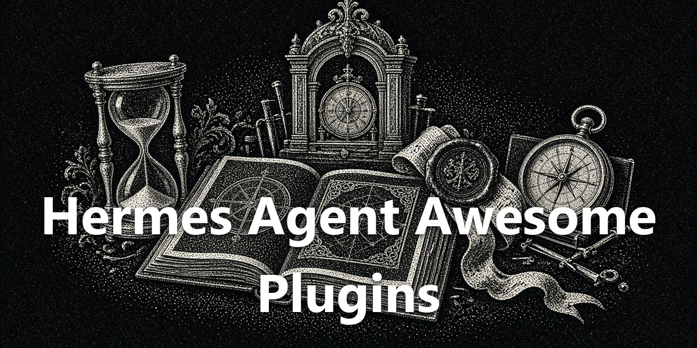

<!-- markdownlint-disable MD033 -->

<div align="center">
  <a href="https://github.com/NousResearch/hermes-agent">
    
  </a>
</div>

<div align="center">

  <h1>Hermes Agent Awesome Plugins</h1>

  <p>Give Hermes Desktop useful tools for provider limits, long sessions, feeds, and memory. Sixteen plugins. Fourteen have a catalog-safe public edition. Two stay personal until a catalog hook exists.</p>

  <p>
    <a href="#readme"></a>
    <a href="./package.json"></a>
    <a href="https://github.com/apoapostolov/hermes-agent-awesome-plugins/releases/tag/v1.22.0"></a>
    <a href="https://github.com/apoapostolov/hermes-agent-awesome-plugins/releases/tag/v1.22.0"></a>
    <a href="./LICENSE"></a>
  </p>

</div>

<div align="center">
  
</div>

## Latest plugin update

Provider Status 1.5.14 signs a provider off in one Log out click, opens Connect in the system browser, and keeps the chip line up when Grok has a large account pool. Intelligent Tool Break 1.3.4 moves the public edition's settings onto the plugin SDK storage hook.

Restart Hermes Desktop after updating; the Python and desktop halves do not reload in place.

The pack remains at 1.22.0. See the [changelog](CHANGELOG.md) for plugin-level updates and the distinction between personal and public builds.

## Personal and public

This repository keeps two trees.

**[personal/](personal/README.md)** is the full-featured edition I run. These builds may reach into Hermes Desktop internals: app DOM, persisted app keys, raw bridge calls. A Desktop update can break them. They sit outside the plugin SDK contract, so install them only if you accept that risk. The pack pins this tree.

**[public/](public/README.md)** is the catalog edition. These builds stay inside the Hermes plugin SDK (`ctx.register*`, `host.state` / `host.request`, `ctx.storage`, `ctx.rest`) so they can be listed. When Desktop has no hook yet, the public copy drops that surface. Fourteen of the sixteen plugins have one; `better-capabilities` and `sessionretitler` stay personal until a catalog hook exists, and each table below marks those rows.

```bash
hermes plugins install apoapostolov/hermes-agent-awesome-plugins/personal/<id>
hermes plugins install apoapostolov/hermes-agent-awesome-plugins/public/<id>
```

The pack command in [Install](#install) pulls `personal/<id>`.

Agent rules for these trees live in [AGENTS.md](AGENTS.md). Catalog blockers for the personal editions live in each plugin's `LIMITATIONS.md`.

## What's in the Pack

Each row links the personal edition you get from the pack, plus the public catalog edition where one exists.

Thirteen plugins are pinned in `hermes-pack.yaml` (pack version 1.22.0). **reasoning-switch**, **prompt-enhance**, and **hermes-jev-routing** live in this repo but are **not** in the pack, so install any of them separately if you want it. The pack pins the personal tree for all thirteen.

### Status Bar

| Plugin | What you get |
| --- | --- |
| [provider-status](personal/provider-status/README.md) · [public](public/provider-status/README.md) | Status-bar quota used/remaining. DeepSeek and GLM peak/off-peak gauges with countdowns. Multi-account. Rotate on low quota or reset day. Grok/Codex OAuth. Providers: Tavily, OpenCode Go, DeepSeek, GLM (z.ai), OpenRouter, Grok (xAI), Codex (OpenAI), OpenAI, Anthropic, Groq, Cerebras, Moonshot Kimi, MiniMax, Google Gemini, Hugging Face, Mistral, Qwen. |
| [iteration-budget-meter](personal/iteration-budget-meter/README.md) · [public](public/iteration-budget-meter/README.md) | Per-turn N/budget while work runs. Hover and click for request stats. |
| [reasoning-switch](personal/reasoning-switch/README.md) · [public](public/reasoning-switch/README.md) | Cycle reasoning effort from the status bar, with colors and per-level prompt demote. **Not in the pack; enable separately.** |

### Tools and Memory

| Plugin | What you get |
| --- | --- |
| [intelligent-tool-break](personal/intelligent-tool-break/README.md) · [public](public/intelligent-tool-break/README.md) | `/break`, `/break {msg}`, and `/again`. Desktop strip. Turn stays alive. |
| [memory-review](personal/memory-review/README.md) · [public](public/memory-review/README.md) | Checkbox staged memory writes. Approve or reject from a dialog. |
| [better-capabilities](personal/better-capabilities/README.md) (personal only) | Delete plugins/skills. Zip a skill. On/off presets. |
| [cdp-manager](personal/cdp-manager/README.md) · [public](public/cdp-manager/README.md) | Launch, stop, and recheck local Chrome CDP ports from the status bar. The `cdp` tool does the same from chat, on your preferred port. |
| [hermes-jev-routing](personal/hermes-jev-routing/README.md) · [public](public/hermes-jev-routing/README.md) | Per-turn model routing from TypeSafe Jev. Both editions switch the live session; the personal one also reads the provider catalogue and Codex quota. **Not in the pack; enable separately.** |

### Sessions and Sidebar

| Plugin | What you get |
| --- | --- |
| [better-session-appearance](personal/better-session-appearance/README.md) · [public](public/better-session-appearance/README.md) | Idle color, bold, and icon. Auto Rules by title keywords. |
| [sidebar-manager](personal/sidebar-manager/README.md) · [public](public/sidebar-manager/README.md) | Hide and reorder nav rows and session sections. |
| [drag-to-pin-session](personal/drag-to-pin-session/README.md) · [public](public/drag-to-pin-session/README.md) | Drag pin/unpin with lasting order. |
| [sessionretitler](personal/sessionretitler/README.md) (personal only) | Retitles the session every N titleable user messages, from the latest exchanges. A title you set yourself is never touched. |
| [scroll-on-switch](personal/scroll-on-switch/README.md) · [public](public/scroll-on-switch/README.md) | Snap to bottom on session switch. Does not fight streaming. |

### Composer

| Plugin | What you get |
| --- | --- |
| [opaque-composer](personal/opaque-composer/README.md) · [public](public/opaque-composer/README.md) | Solid composer while the transcript scrolls behind it. |
| [prompt-enhance](personal/prompt-enhance/README.md) · [public](public/prompt-enhance/README.md) | Rewrite a composer draft from a saved prompt library and put the finished prompt back in the field. **Not in the pack; enable separately.** |

### Reading

| Plugin | What you get |
| --- | --- |
| [rss-reader](personal/rss-reader/README.md) · [public](public/rss-reader/README.md) | Three-column reader. Folders, mute/search, capture. Optional Hermes tools and ticker. |

Two plugins in this repo are not in the pack and are installed separately: **reasoning-switch** (Status Bar table) and **prompt-enhance** (Composer table). Every other plugin above is pinned by the pack.

## Install

Requires [Hermes Agent](https://github.com/NousResearch/hermes-agent) **0.21.0 or newer**.

```bash
hermes plugins pack install https://raw.githubusercontent.com/apoapostolov/hermes-agent-awesome-plugins/main/hermes-pack.yaml
```

Each plugin keeps its own capability consent. Packs do not bulk-grant. Secrets stay `requires_env` and are never embedded in the pack.

Verify:

```bash
hermes plugins list
hermes plugins pack show https://raw.githubusercontent.com/apoapostolov/hermes-agent-awesome-plugins/main/hermes-pack.yaml
```

For a single plugin, follow that plugin's README. For **reasoning-switch** and **prompt-enhance**, use the README because the pack does not install them.

## How It Works

`hermes-pack.yaml` pins each pack entry to `repo` + `subdir` + an exact 40-character commit. Hermes expands those into ordinary plugin installs. What you get matches the pinned SHAs, not whichever tip happens to be on `main` that day.

Most plugins are desktop-only. Check the individual README for platform and surface limits.

## Requirements and Limits

- Hermes Agent **0.21.0 or newer** for shareable plugin packs.
- Windows, macOS, or Linux for the pack itself.
- Individual plugins may need a narrower desktop surface or a full Desktop quit/reopen after first install.
- Provider services keep their own usage limits and costs.

This is an independent community project. It does not change Hermes Agent core, bulk-grant capabilities, or silently send plugin data elsewhere. Per-plugin data handling is in each README.

## Documentation

- [Personal editions](personal/README.md)
- [Public editions](public/README.md)
- [AGENTS.md](AGENTS.md): personal/public backport and version rules
- [provider-status](personal/provider-status/README.md)
- [intelligent-tool-break](personal/intelligent-tool-break/README.md)
- [iteration-budget-meter](personal/iteration-budget-meter/README.md)
- [reasoning-switch](personal/reasoning-switch/README.md) (not in the pack)
- [better-session-appearance](personal/better-session-appearance/README.md)
- [sidebar-manager](personal/sidebar-manager/README.md)
- [drag-to-pin-session](personal/drag-to-pin-session/README.md)
- [scroll-on-switch](personal/scroll-on-switch/README.md)
- [opaque-composer](personal/opaque-composer/README.md)
- [prompt-enhance](personal/prompt-enhance/README.md) (not in the pack)
- [memory-review](personal/memory-review/README.md)
- [better-capabilities](personal/better-capabilities/README.md)
- [cdp-manager](personal/cdp-manager/README.md)
- [rss-reader](personal/rss-reader/README.md)

## Support

Report problems or follow releases through [@ApoMakesMods](https://x.com/ApoMakesMods) on X.

## License

[MIT](LICENSE) © Apostol Apostolov

This is an independent community project. It is not affiliated with, endorsed by, sponsored by, or officially associated with Nous Research or Hermes Agent. Hermes, Hermes Agent, and Nous Research are names and marks belonging to their respective owners.
