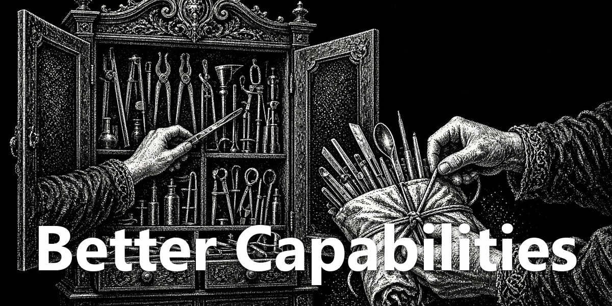
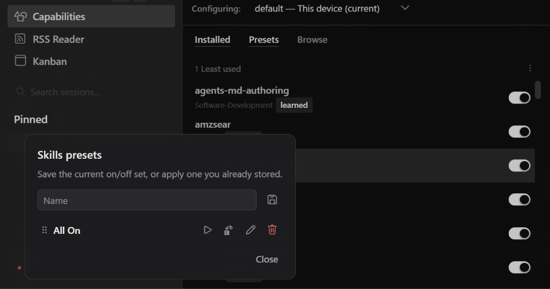

<div align="center">
  <a href="https://github.com/NousResearch/hermes-agent"></a>
  <h1>Better Capabilities</h1>
  <strong>Delete plugins and skills, zip a skill, save on/off presets.</strong>
  <p>Recycle Bin delete, Package (zip) for learned skills, and `/preset` apply from chat.</p>
  <p>
    <a href="plugin.yaml"></a>
    <a href="../../LICENSE"></a>
  </p>
</div>

<div align="center">
  
</div>

## Screenshot

<div align="center">
  
  
</div>

## What You Can Do

- Delete a plugin or skill from Capabilities. The folder goes to the Recycle Bin; if that fails, it is moved aside under `plugins-disabled/`.
- Package (zip) a learned skill, including `references/` and other supporting files. `__pycache__` and `.git` stay out.
- Browse other markdown files in a skill after Edit (folder headers like `/references`). Switching skills returns to SKILL.md.
- Save on/off presets on a Presets tab. Apply, overwrite, rename, or delete them from the UI.
- Snapshot and apply from chat: `/preset save skills {name}`, `/preset save plugins {name}`, `/preset skills {name}`, `/preset plugins {name}`. Plugin presets keep Agent on/off for every profile that existed at save time.

## Install

Requires [Hermes Agent](https://github.com/NousResearch/hermes-agent) **0.21.0 or newer**.

```bash
hermes plugins pack install https://raw.githubusercontent.com/apoapostolov/hermes-agent-awesome-plugins/main/hermes-pack.yaml
```

Or install just this plugin:

```bash
hermes plugins install apoapostolov/hermes-agent-awesome-plugins/plugins/better-capabilities
```

Enable **Better Capabilities** under **Capabilities → Plugins**. Zip and delete need the plugin's Python routes, which mount when Desktop starts. If those buttons error after a first install, fully quit and reopen Hermes Desktop once.

## Requirements / Limits

Desktop plugin with a small Python API. Acts only on folders under the local Hermes `plugins/`, `desktop-plugins/`, and `skills/` trees. Recycle Bin is preferred; `plugins-disabled/` is the fallback when trash is unavailable.

## License

[MIT](../../LICENSE)
