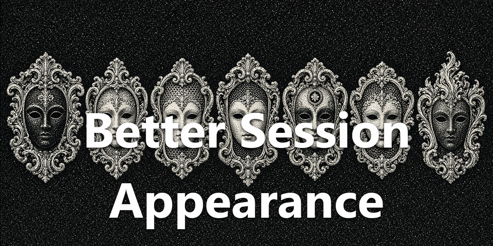
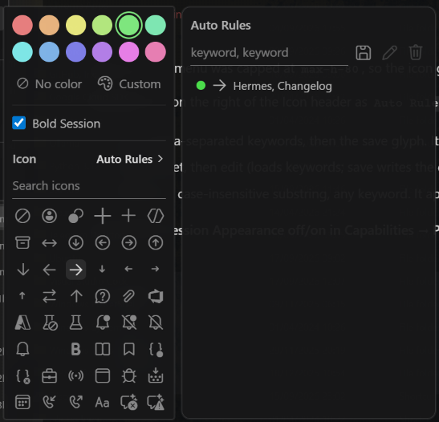

<div align="center">
  <a href="https://github.com/NousResearch/hermes-agent"></a>
  <h1>Better Session Appearance</h1>
  <strong>Make session names easier to scan.</strong>
  <p>Idle color, bold, and icon — plus Auto Rules that match title keywords.</p>
  <p>
    <a href="plugin.yaml"></a>
    <a href="../../LICENSE"></a>
  </p>
</div>

<div align="center">
  
</div>

## Screenshot

<div align="center">
  
</div>

## What You Can Do

- Color the session title for idle rows. Lightness adjusts for light and dark themes so one hue stays readable.
- Bold a session name per chat.
- Pick an idle icon from the Codicon set (search included). Working and finished-unread status dots stay Hermes's.
- Save Auto Rules: color, bold, and icon keyed to title keywords (comma or space; all words must match; case-insensitive). Future sessions that match pick up that look. Edit or remove rules from the list.

## Install

Requires [Hermes Agent](https://github.com/NousResearch/hermes-agent) **0.21.0 or newer**.

```bash
hermes plugins pack install https://raw.githubusercontent.com/apoapostolov/hermes-agent-awesome-plugins/main/hermes-pack.yaml
```

Enable **Better Session Appearance** under **Capabilities → Plugins**.

## Requirements / Limits

Desktop-only. Appearance applies to idle session rows. Hermes keeps ownership of working and unread status dots.

## License

[MIT](../../LICENSE)
