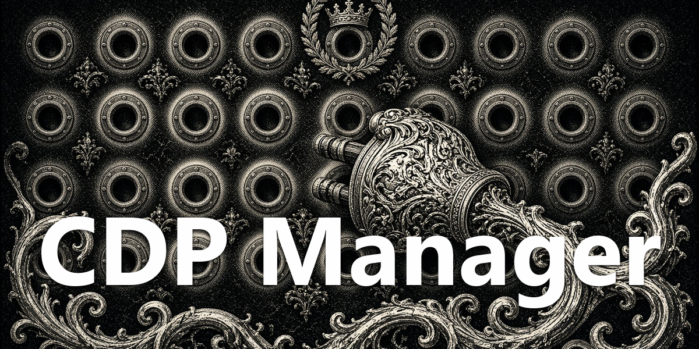

# CDP Manager

<div align="center">
  
</div>

Statusbar plugin + `cdp` agent tool for managing local Chrome DevTools
Protocol (CDP) debug ports on 127.0.0.1.

- Statusbar plug glyph opens the port dialog: live state, browser, pid and
  latency per port, probed only while the dialog is open.
- Per-port glyph buttons: launch (starts Chrome with
  `--remote-debugging-port`, no visible terminal), stop (clean
  `Browser.close` over the endpoint's WebSocket), recheck.
- Checkmark button marks one port as the preferred default.
- The `cdp` agent tool lets the agent do all of the above from chat:
  `status`, `launch`, `stop`, `recheck`, `prefer` - no bash, no PowerShell.
  It targets the preferred port when none is given, then the sole live port.

## Install

```
hermes plugins install apoapostolov/hermes-agent-awesome-plugins/personal/cdp-manager
```

Then enable it:

```
hermes plugins enable cdp-manager --no-allow-tool-override
```

The desktop dialog needs a full Hermes quit/reopen the first time (the
Python backend routes mount with the dashboard server). The `cdp` tool is
usable from the next session after enabling.

## Files

- `desktop/plugin.js` - statusbar chip + dialog
- `dashboard/plugin_api.py` - FastAPI routes at `/api/plugins/cdp-manager/`
- `cdp_core.py` - probe/launch/stop logic, config
- `cdp_tools.py` + `schemas.py` - the `cdp` agent tool
