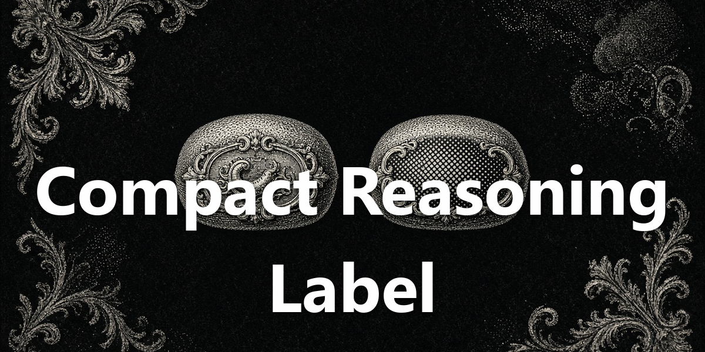

<div align="center">
  <a href="https://github.com/NousResearch/hermes-agent"></a>
  <h1>Compact Reasoning Label</h1>
  <strong>Model pill shows the model. Reasoning pill shows the level.</strong>
  <p>Strips the duplicated effort word from the composer model label.</p>
  <p>
    <a href="plugin.yaml"></a>
    <a href="../../LICENSE"></a>
  </p>
</div>

<div align="center">
  
</div>

## Screenshot

<div align="center">
  
</div>

## What You Can Do

- Read a model name only in the model pill (for example "Grok 4.6" instead of "Grok 4.6 Medium").
- Leave the effort word on the reasoning pill beside it, which still changes the level when clicked.
- Cover standardized effort labels in short and full forms (Off, Min, Low, Med/Medium, High, XHigh/Extra High, Max, Ultra).
- Keep the label intact if stripping would leave nothing.

## Install

Requires [Hermes Agent](https://github.com/NousResearch/hermes-agent) **0.21.0 or newer**.

```bash
hermes plugins pack install https://raw.githubusercontent.com/apoapostolov/hermes-agent-awesome-plugins/main/hermes-pack.yaml
```

Or install just this plugin:

```bash
hermes plugins install apoapostolov/hermes-agent-awesome-plugins/plugins/compact-reasoning-label
```

Enable **Compact Reasoning Label** under **Capabilities → Plugins**. Reload desktop plugins from **Cmd+K** or **Ctrl+K** on Windows if needed.

## Requirements / Limits

Desktop-only. No gateway or Python runtime required.

## License

[MIT](../../LICENSE)
