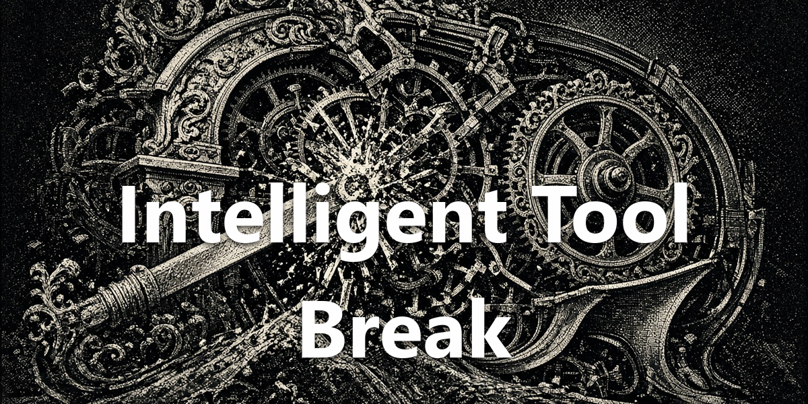

<div align="center">
  <a href="https://github.com/NousResearch/hermes-agent"></a>
  <h1>Intelligent Tool Break</h1>
  <strong>Stop a stalled tool call without killing the turn.</strong>
  <p>`/break`, `/break {msg}`, and `/again` — plus a desktop strip beside active work.</p>
  <p>
    <a href="plugin.yaml"></a>
    <a href="../../LICENSE"></a>
  </p>
</div>

<div align="center">
  
</div>

## What You Can Do

- `/break` stops the newest in-flight spawn tree and keeps the turn alive.
- `/break {message}` stops the call and gives the model your correction.
- `/again` retries the last call; `/again {hint}` retries with a tweak.
- `/break-status` lists what is currently killable.
- Use the desktop strip (Break, Message, Again, elapsed time, per-tool controls) or `mod+shift+b`.

Previously published as `hermes-break`. The commands stay compatible.

## Install

Requires [Hermes Agent](https://github.com/NousResearch/hermes-agent) **0.21.0 or newer**.

```bash
hermes plugins pack install https://raw.githubusercontent.com/apoapostolov/hermes-agent-awesome-plugins/main/hermes-pack.yaml
```

Enable **Intelligent Tool Break** under **Capabilities → Plugins**.

## Requirements / Limits

Depends on Hermes' active spawn and composer surfaces. If a future Hermes release changes those contracts, controls may disappear until compatibility is updated. In-process hangs that never return still need a hard abort.

## License

[MIT](../../LICENSE)
