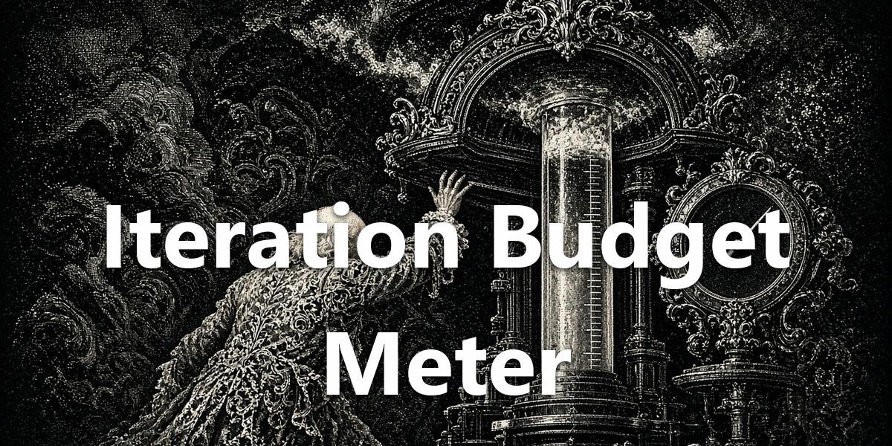
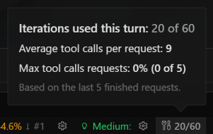

<div align="center">
  <a href="https://github.com/NousResearch/hermes-agent"></a>
  <h1>Iteration Budget Meter</h1>
  <strong>See per-turn tool-call usage while work runs.</strong>
  <p>N/budget in the status bar. Hover and click for request stats.</p>
  <p>
    <a href="plugin.yaml"></a>
    <a href="../../LICENSE"></a>
  </p>
</div>

<div align="center">
  
</div>

## See It in Action



## What You Can Do

- Watch tool-call usage against the session's iteration budget while a turn is active.
- Hover for request stats. Click for averages, ceiling-hit ratio, and a data-based ceiling suggestion when the numbers support one.
- Each turn resets its own counter, so the chip tracks the current turn only.

## Install

Requires [Hermes Agent](https://github.com/NousResearch/hermes-agent) **0.21.0 or newer**.

```bash
hermes plugins pack install https://raw.githubusercontent.com/apoapostolov/hermes-agent-awesome-plugins/main/hermes-pack.yaml
```

Enable **Iteration Budget Meter** under **Capabilities → Plugins**. The meter appears in the desktop status bar when a turn is active.

## Requirements / Limits

Desktop-only. Budget ceilings stay under Hermes and the connected model configuration. This plugin reports usage; it does not raise the cap for you.

## License

[MIT](../../LICENSE)
