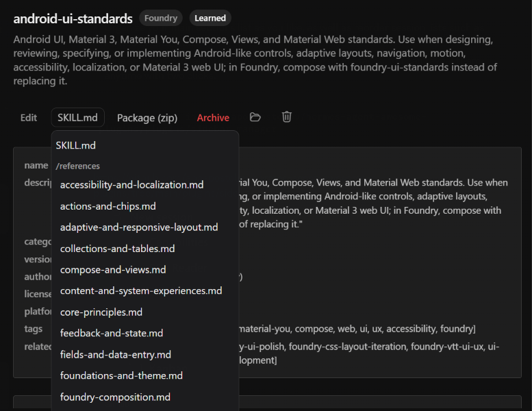

<div align="center">
  <a href="https://github.com/NousResearch/hermes-agent"></a>
  <h1>Better Capabilities</h1>
  <strong>Remove plugins and skills from Capabilities, and zip a skill folder.</strong>
  <p>Adds a delete control next to the folder icon, and a Package (zip) button between Edit and Archive on a learned skill.</p>
  [](plugin.yaml) [](../../LICENSE)
</div>

## Screenshot

<div align="center">
  
  
</div>

## What it does

- Puts a delete control immediately to the right of the folder icon on a Capabilities plugin row.
- Puts Package (zip) between Edit and Archive on a learned skill, and adds a folder reveal plus delete on that same row.
- After Edit, a SKILL.md dropdown lists every markdown file in the skill (folder headers like `/references`). Other files preview in the pane without the frontmatter box. Switching skills returns to SKILL.md.
- Adds a Presets tab between Installed and Browse on Skills and Plugins (and on Tools). Save the current on/off set with a name. Apply, Overwrite, Rename, or Delete each preset.
- Chat commands: `/preset save skills {name}` and `/preset save plugins {name}` snapshot the current on/off set. `/preset skills {name}` and `/preset plugins {name}` apply that preset. Plugin presets keep Agent on/off for every profile that existed at save time.
- Delete sends the on-disk folder to the Recycle Bin. If the Recycle Bin call cannot finish, the folder is moved aside under `plugins-disabled/`.
- Package downloads a zip of the skill folder, including `references/` and other supporting files. `__pycache__` and `.git` stay out of the archive.

## Install

```bash
hermes plugins install apoapostolov/hermes-agent-awesome-plugins/plugins/better-capabilities
```

Enable **Better Capabilities** under **Capabilities → Plugins**. The zip and delete actions need the plugin's Python routes, which mount when the desktop app starts. If those buttons error after a first install, fully quit and reopen Hermes Desktop once.

## Compatibility

Desktop plugin with a small Python API. It only acts on folders under the local Hermes `plugins/`, `desktop-plugins/`, and `skills/` trees.

## Development and license

The UI is `desktop/plugin.js`. The recycle and zip routes are `dashboard/plugin_api.py`. Licensed under [MIT](../../LICENSE).
