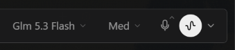

<div align="center">
  <a href="https://github.com/NousResearch/hermes-agent"></a>
  <h1>Compact Reasoning Label</h1>
  <strong>The model pill shows the model. The reasoning pill shows the level.</strong>
  <p>Strips the thinking-level word from the composer's model dropdown label so each pill carries exactly one piece of information.</p>
  <p>
    <a href="plugin.yaml"></a>
    <a href="../../LICENSE"></a>
  </p>
</div>

## Screenshot

<div align="center">
  
</div>

## What it does

- The composer's model pill reads "Grok 4.6 Medium" even though a separate reasoning pill already shows the level. This plugin removes the duplicated effort word, so the model pill reads "Grok 4.6" and the reasoning pill reads "Medium".
- Understands every standardized effort label (Off, Min, Low, Med, Medium, High, XHigh, Extra High, Max, Ultra) in both short and full forms.
- Re-strips after every React repaint through an idempotent MutationObserver with a 1-second safety sweep. Writes are guarded, so the observer can never loop against itself.
- Never blanks the pill: if stripping would leave nothing, the label is left alone.
- Keeps the reasoning pill fully functional. Click it to change the level as usual.

## Install

Install the pack and enable **Compact Reasoning Label** under **Capabilities → Plugins**:

```bash
hermes plugins pack install https://raw.githubusercontent.com/apoapostolov/hermes-agent-awesome-plugins/main/hermes-pack.yaml
```

Or install just this plugin:

```bash
hermes plugins install apoapostolov/hermes-agent-awesome-plugins/plugins/compact-reasoning-label
```

Reload desktop plugins from **Cmd+K** or **Ctrl+K** on Windows.

## Compatibility

Desktop-only. No gateway or Python runtime is required. The plugin targets the composer root slot and the model/reasoning pill test IDs in Hermes Desktop.

## Development and license

The implementation is in `desktop/plugin.js`. Metadata is in `plugin.yaml`. Licensed under [MIT](../../LICENSE).
