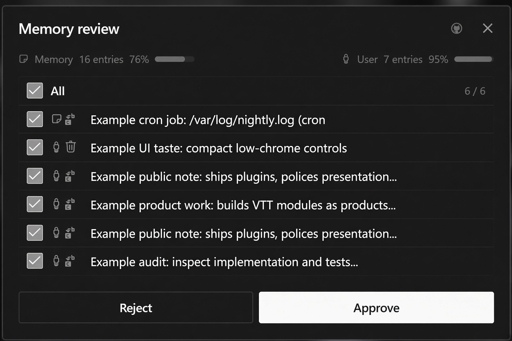

<div align="center">
  <a href="https://github.com/NousResearch/hermes-agent"></a>
  <h1>Memory Review</h1>
  <strong>Review staged memory writes before they land.</strong>
  <p>Open a Hermes-style dialog, select the writes you want, and approve or reject them deliberately.</p>
  [](plugin.yaml) [](../../LICENSE)
</div>

## Screenshot

<div align="center">
  
</div>

## What it does

- **Open pending memory.** Use **Ctrl+K → Memory: pending** or right-click empty app chrome.
- **Choose the writes.** Select individual rows or use **All**.
- **Decide once.** Approve or reject the selected staged writes from the dialog.
- **Keep the boundary visible.** The plugin reviews pending writes; it does not silently approve them.

## Install

Install the pack and enable **Memory Review** under **Capabilities → Plugins**:

```bash
hermes plugins pack install https://raw.githubusercontent.com/apoapostolov/hermes-agent-awesome-plugins/main/hermes-pack.yaml
```

The JavaScript UI hot-reloads. Python dashboard routes mount after a full Hermes Desktop quit and reopen.

## How it works

The desktop component provides the palette, context-menu entry, and review dialog. The dashboard API exposes `GET /state` and `POST /decide` for reading the pending queue and recording the selected decision.

## Files and license

- `desktop/plugin.js`: palette, menu, and dialog
- `dashboard/plugin_api.py`: state and decision routes
- `dashboard/manifest.json`: dashboard registration
- `__init__.py`: agent-side registration

Licensed under [MIT](../../LICENSE).
