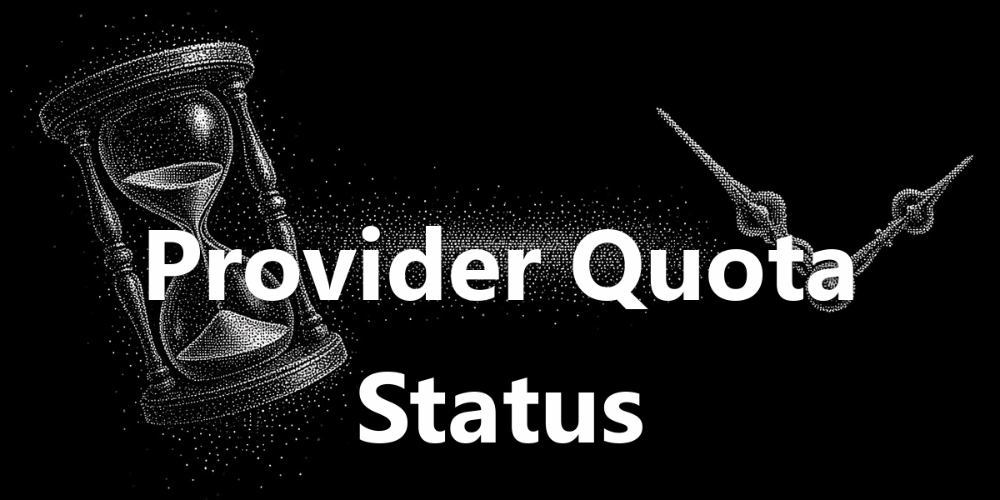

<div align="center">
  <a href="https://github.com/NousResearch/hermes-agent"></a>
  <h1>Provider Quota Status</h1>
  <strong>See provider health and quota without leaving Hermes.</strong>
  <p>Track enabled providers in the status bar, keep multiple credentials organized, and rotate keys when a pool is exhausted.</p>
  <p>
    <a href="plugin.yaml"></a>
    <a href="../../LICENSE"></a>
  </p>
</div>

<div align="center">
  
</div>

## Screenshot

<div align="center">
  
</div>

## What it does

Provider Quota Status turns provider setup and quota checks into one desktop surface:

- **Read the status bar.** See used and remaining quota for each enabled provider, with color-coded thresholds.
- **Keep keys in order.** Paste credentials, reorder rows, set polling intervals, and choose a reset day per key.
- **Rotate safely.** Switch to the next healthy key when remaining quota reaches the configured threshold or a renewal day passes.
- **Use OAuth where supported.** Start the Grok and Codex browser login flows from the setup dialog.

Supported providers include `tavily`, `opencode`, `deepseek`, `glm`, `openrouter`, `grok`, and `codex`.

## Install

Install the pack and enable **Provider Quota Status** under **Capabilities → Plugins**:

```bash
hermes plugins pack install https://raw.githubusercontent.com/apoapostolov/hermes-agent-awesome-plugins/main/hermes-pack.yaml
```

Open the status-bar gear to configure providers. Copy an example configuration when starting manually. Never commit real keys.

## How it works

The desktop UI reads status from the dashboard API at `/api/plugins/provider-status/*`. Configuration is stored in the plugin data directory. `library.env` retains previously entered keys so a rotation does not discard an older subscription.

## Files and development

- `desktop/plugin.js`: status-bar chips and setup dialog
- `dashboard/plugin_api.py`: status and configuration API
- `dashboard/manifest.json`: dashboard registration
- `__init__.py`: agent-side registration

## Limits

Quota values depend on each provider's API. OAuth availability, reset behavior, and account limits follow the provider. This plugin displays and manages configured credentials; it does not remove provider billing or usage limits.

## License

[MIT](../../LICENSE). This is an independent community plugin for Hermes Agent.
