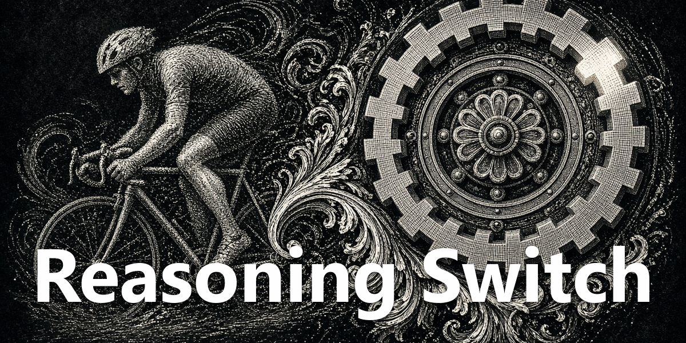

<div align="center">
  <a href="https://github.com/NousResearch/hermes-agent"></a>
  <h1>Reasoning Switch</h1>
  <strong>Change reasoning effort without opening model settings.</strong>
  <p>Cycle the focused session through the levels you choose, with colors and prompt limits that make the current setting visible.</p>
  <p>
    <a href="plugin.yaml"></a>
    <a href="../../LICENSE"></a>
  </p>
</div>

<div align="center">
  
</div>

## What it does

- **Cycle from the status bar.** The active level is visible and a click advances through your selected rotation.
- **Use standard levels.** Choose from `none`, `minimal`, `low`, `medium`, `high`, `xhigh`, `max`, and `ultra`.
- **Set prompt limits.** Demote a level after a chosen number of user prompts, such as High for three prompts then Medium.
- **Keep the change local.** The focused session changes; the global profile default does not.

## Install

Install the pack and enable **Reasoning Switch** under **Capabilities → Plugins**:

```bash
hermes plugins pack install https://raw.githubusercontent.com/apoapostolov/hermes-agent-awesome-plugins/main/hermes-pack.yaml
```

Use the status-bar word to cycle and its gear to configure levels, colors, and limits.

## How it works

The plugin calls the same session-scoped `config.set` gateway path used by Hermes' model menu. The prompt counter follows the focused session's awaiting-response signal.

## Compatibility and license

Desktop-only. Reasoning levels are validated by the Hermes backend, so available behavior follows the connected version. Licensed under [MIT](../../LICENSE).
