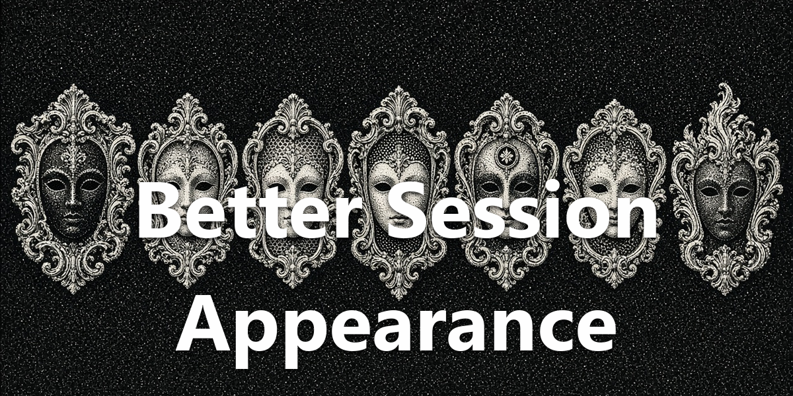

<div align="center">
  <a href="https://github.com/NousResearch/hermes-agent"></a>
  <h1>Better Session Appearance</h1>
  <strong>Make session names easier to scan.</strong>
  <p>Give each session its own color and idle icon in the session list.</p>
  <p>
    <a href="plugin.yaml"></a>
    <a href="../../LICENSE"></a>
  </p>
</div>

<div align="center">
  
</div>

## What You Can Do

- Give a session a color from the Appearance picker. It shows on that row’s dot.
- Pick an idle icon from the Codicon set (search included). Working and finished-unread status dots stay Hermes’s.
- Clear a color or icon to hand the row back to Hermes.

## Install

Requires [Hermes Agent](https://github.com/NousResearch/hermes-agent) **0.21.0 or newer**.

```bash
hermes plugins pack install https://raw.githubusercontent.com/apoapostolov/hermes-agent-awesome-plugins/main/hermes-pack.yaml
```

Enable **Better Session Appearance** under **Capabilities → Plugins**.

## Requirements / Limits

Desktop-only. The color and icon apply to idle session rows; Hermes keeps ownership of working and unread status dots. Bold session titles and Auto Rules are not part of this edition, since the SDK has no session-title area to decorate. See `LIMITATIONS.md`.

## License

[MIT](../../LICENSE)
