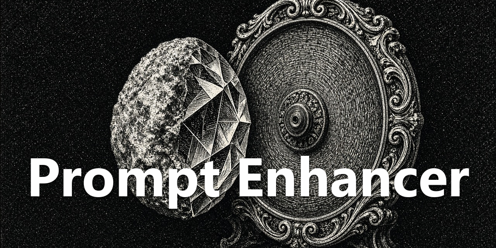

<div align="center">
  <a href="https://github.com/NousResearch/hermes-agent"></a>
  <h1>Prompt Enhancer</h1>
  <strong>Turn a rough composer draft into the prompt you meant.</strong>
  <p>Enhancers rewrite the draft outside the chat. The library keeps the prompts you reuse.</p>
  <p>
    <a href="plugin.yaml"></a>
    <a href="../../LICENSE"></a>
  </p>
</div>

<div align="center">
  
</div>

## What You Can Do

- Rewrite the current draft with a saved enhancer. The call runs outside the chat, the composer icon spins while it works, and the result replaces the draft.
- Undo that rewrite back to the previous composer text.
- Keep prompts in folders, reorder them, import the current draft, insert one into the composer, or send one with the draft as context.
- Pick an enhance model for one call. That pick does not write the session model.

## Install

Requires [Hermes Agent](https://github.com/NousResearch/hermes-agent) **0.21.0 or newer**.

```bash
hermes plugins install apoapostolov/hermes-agent-awesome-plugins/public/prompt-enhancer
```

Enable **Prompt Enhancer** under **Capabilities → Plugins**. Reload desktop plugins from **Cmd+K** or **Ctrl+K** on Windows if needed.

## Requirements / Limits

Desktop composer only. Enhancement uses a one-shot model call and does not post into the open chat. Needs a focused composer with text in it.

## License

[MIT](../../LICENSE)
