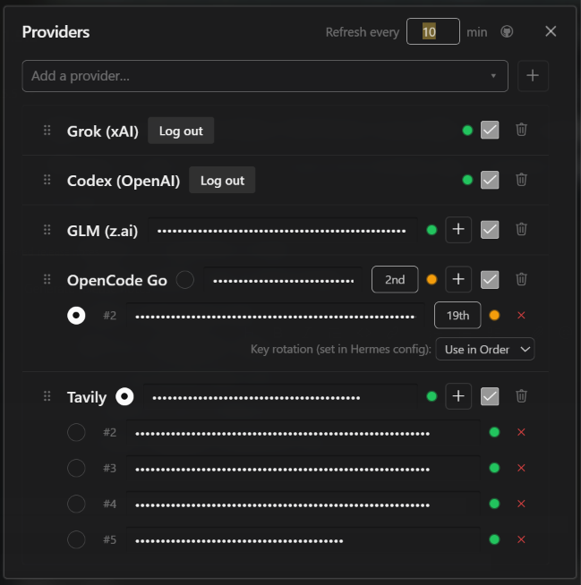

<div align="center">
  <a href="https://github.com/NousResearch/hermes-agent"></a>
  <h1>Provider Quota Status</h1>
  <strong>See provider quota without leaving Hermes.</strong>
  <p>Status-bar used/remaining and user-managed provider pools. Polling is read-only for vendor credentials.</p>
  <p>
    <a href="plugin.yaml"></a>
    <a href="../../LICENSE"></a>
  </p>
</div>

<div align="center">
  
</div>

## Screenshot

<div align="center">
  
</div>

## What You Can Do

- Read used and remaining quota in the status bar for each enabled provider.
- Keep multiple accounts per provider and inspect their status.
- Use an access token that is already configured in the plugin. Expired OAuth tokens require a new login.
- Provider polling does not read vendor CLI auth files, refresh vendor tokens, write Hermes `.env` or `config.yaml`, or copy secrets into a plugin-owned `library.env`.

**Disclosure:** quota checks for Codex and Grok use the documented client identity and user-agent expected by their CLI-compatible endpoints. The public edition sends keys only to their own provider endpoints and does not collect telemetry.

Supported providers: `tavily`, `opencode`, `deepseek`, `glm`, `openrouter`, `grok`, `codex`.

## Install

Requires [Hermes Agent](https://github.com/NousResearch/hermes-agent) **0.21.0 or newer**.

```bash
hermes plugins pack install https://raw.githubusercontent.com/apoapostolov/hermes-agent-awesome-plugins/main/hermes-pack.yaml
```

Enable **Provider Quota Status** under **Capabilities → Plugins**. Open the status-bar gear to configure providers. Never commit real keys.

The public edition keeps quota chips, provider probes, device login, and plugin-owned configuration. It does not perform automatic key rotation into Hermes configuration. An expired OAuth token requires logging in again.

## Requirements / Limits

Desktop-only. Quota numbers come from each provider's API. OAuth availability, reset behavior, and account limits follow the provider. This plugin manages configured credentials; it does not remove billing or usage caps.

## License

[MIT](../../LICENSE)
