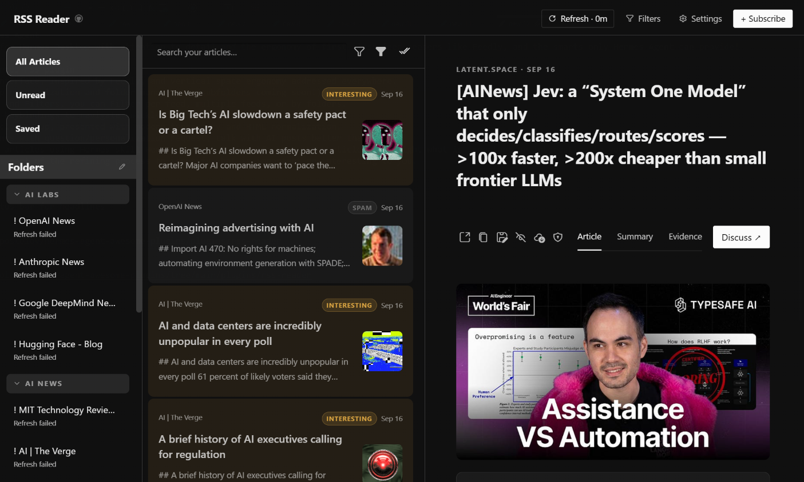

<div align="center">
  <a href="https://github.com/NousResearch/hermes-agent"></a>
  <h1>RSS Reader</h1>
  <strong>A three-column place for feeds you mean to finish.</strong>
  <p>Folders, mute and search, reader-mode capture, YouTube and Substack feeds, optional Hermes tools, and an optional headline ticker.</p>
  <p>
    <a href="https://github.com/NousResearch/hermes-agent"></a>
    <a href="plugin.yaml"></a>
    <a href="../../LICENSE"></a>
  </p>
</div>

<div align="center">
  
</div>

## Screenshot

<div align="center">
  
</div>

## What You Can Do

- Subscribe to RSS 2.0 and Atom feeds, plus Reddit `r/...` communities, YouTube channels and playlists, and Substack pages. Starter pills help fill common sources, including YouTube and Substack.
- Organize with folders and nested folders. Move feeds between them.
- Work from unread, saved, feed, folder, mute, and search views without losing the article you have open.
- Capture full articles into reader mode (images and tables kept when useful).
- Play YouTube posts in the reader with a 16:9 embed and chapter timestamps. Playlist feeds list oldest first.
- Set a User-Agent and optional YouTube cookies under Settings → Advanced.
- Ask Hermes for summaries, discussions, evidence checks, digests, and optional grading only when you choose.
- Optionally register Hermes tools so the agent can read, find, tag, filter, and manage subscriptions.
- Optionally show an animated headline ticker with grade colors and tag pills.
- Drive the same local library from chat:

```text
/rss refresh
/rss refresh 30m
/rss mute phrase
/rss refine starred
/rss refine 30d
/rss add https://example.com, Example feed
/rss add r/programming
/rss mark-read all
/rss digest unread 7d
/rss health
/rss find …
/rss tag … / /rss untag …
/rss mute tag … / /rss unmute …
```

In Unread view, a selected story is marked read after one second but stays visible until focus moves. Other views mark immediately.

## Install

Requires [Hermes Agent](https://github.com/NousResearch/hermes-agent) **0.21.0 or newer**.

```bash
hermes plugins pack install https://raw.githubusercontent.com/apoapostolov/hermes-agent-awesome-plugins/main/hermes-pack.yaml
```

Or install just this plugin:

```bash
hermes plugins install apoapostolov/hermes-agent-awesome-plugins/public/rss-reader
```

Enable **RSS Reader** under **Capabilities → Plugins**, add a feed URL, and press **Refresh**.

## Requirements / Limits

Desktop reader plus a local Python API for feed, article, grading, and preference work.

- Subscriptions, articles, read/saved state, summaries, and folders stay in the local library.
- Feed and article downloads are bounded. Public HTTP(S) only; no embedded credentials; private hosts blocked.
- An entry may be excerpt-only; full capture depends on the original page.
- Small images (largest dimension 480 px or less) stay capped beside text. Larger images keep reading width.
- Saved stories survive feed removal. Paywall bypass services are not used.
- AI actions receive only the selected or bounded article context.

This plugin is a fork of [Adolanium/hermes-rss](https://github.com/Adolanium/hermes-rss) (MIT). Copyright notices are in [LICENSE](../../LICENSE).

The public edition does not use archive or proxy mirrors, does not submit a self-improvement prompt that edits the installed plugin, and does not import private Hermes gateway internals.

## License

[MIT](../../LICENSE)
